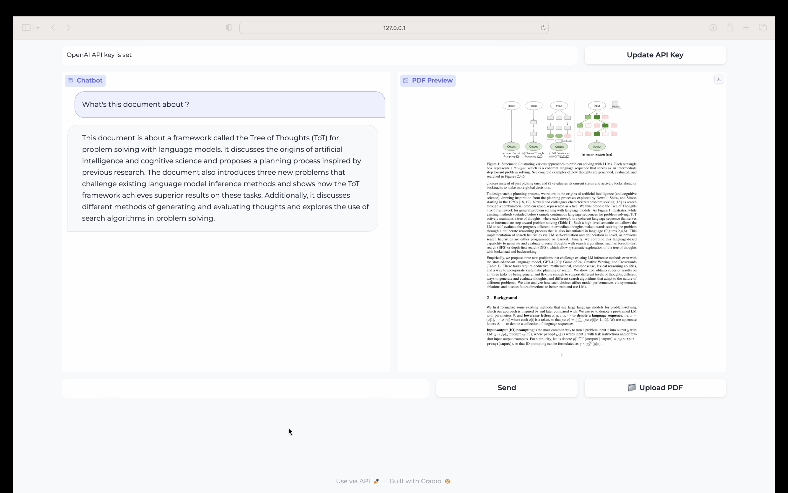

# Chat-with-any-PDF
The PDF Chatbot is an application that allows users to upload PDF files and interact with pdf using a chatbot. Users can ask questions or provide input, and the chatbot will generate responses based on the provided information.

# Technologies Used
Langchain
Gradio
OpenAI API
ChromaDB

# Features
- Chat with a chatbot: Ask questions or have a conversation with the chatbot.  
- Upload PDF files: Preview PDF files by uploading them to the application.  
- Update API Key: Easily update the OpenAI API key used by the chatbot.

 # App Interface + Video Demo

# Demo Video
https://www.youtube.com/watch?v=GsP2IINq9CU

# Installation
Clone the repository:

git clone [https://github.com/anasbelmessid/PDF-ChatGpt.git](https://github.com/anasbelmessid1/Chat-with-any-PDF/)
Install the required dependencies:

pip install -r requirements.txt
Usage
Run the application:

python app.py
Access the application in your web browser as specified in the console.

Enter your OpenAI API key in the provided input box and press enter.

To preview a PDF file, click the "Upload PDF" button and select the PDF file from your local machine. The application will display a preview of the PDF file.

Use the chatbox to ask questions or have a conversation with the chatbot. The chatbot will generate responses based on the input.

# Configuration
The application uses the OpenAI API for generating chatbot responses. Make sure to provide a valid OpenAI API key.

#Contributing
Contributions are welcome! If you encounter any issues or have suggestions for improvements, please feel free to open an issue or submit a pull request.

# License
This project is licensed under the Apache License 2.0.

